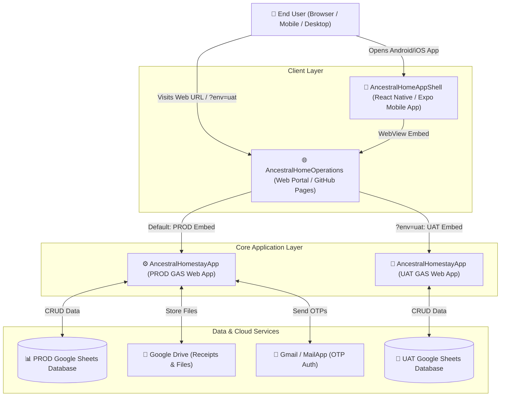
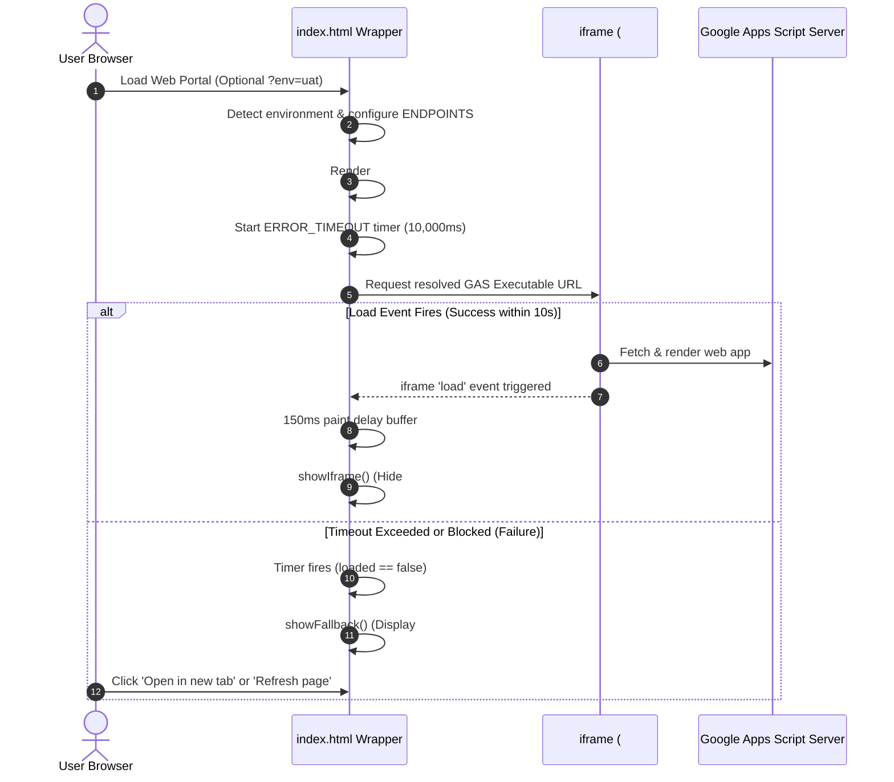

# 🌐 Ancestral Home Operations - Web Portal: Knowledge Base

**Document Version:** 1.1.0  
**Last Updated:** September 2026  
**Primary Repository:** `theancestralhomestay/AncestralHomeOperations`  
**Deployment Target:** Static Web Hosting / GitHub Pages  
**Dynamic Endpoints:**
- **PROD:** `https://script.google.com/macros/s/AKfycbzsSJKyUnW6FDAvHbiDbqRitg2SOPECjgBkk1_vGIZbYsgmf2LuFVQqV4dbyoV-3tg6mQ/exec`
- **UAT:** `https://script.google.com/macros/s/AKfycbyyLa9kOInMAxhZ-Cs0SWuliiyYfvWryEcyxJLyiE0dM0_E3_sWSpAkONIiaM70mGAZNA/exec`

---

## 1. System Overview & Ecosystem Architecture

The **Ancestral Home Operations Web Portal** serves as the lightweight, high-reliability web entryway, dynamic reverse proxy, and responsive wrapper for **The Ancestral Home Operations & Settlement Manager**. It embeds the Google Apps Script (GAS) Web Application inside a secure, full-viewport iframe while providing critical user-experience enhancements: dynamic multi-environment routing (`prod` vs `uat`), seamless loading transitions, device-aware layout handling, accessibility adaptations, and graceful error recovery.

### The Ancestral Homestay Platform Ecosystem



---

## 2. Dynamic Multi-Environment Routing (`?env=uat`)

The portal inspects the query string `window.location.search` on initial load:

| Target Environment | Query Parameter | Portal Entry URL | Embedded Apps Script Deployment | Visual Cues |
| :--- | :--- | :--- | :--- | :--- |
| **Production** | *(None / default)* | `https://theancestralhomestay.github.io/AncestralHomeOperations/` | `AKfycbzsSJKy...` (PROD) | Slate-900 background, Villa logo badge, Amber brand spinner (`#f59e0b`), standard title |
| **UAT / Staging** | `?env=uat` | `https://theancestralhomestay.github.io/AncestralHomeOperations/?env=uat` | `AKfycbyyLa9k...` (UAT) | Slate-900 background, Villa logo badge, Orange brand spinner (`#f97316`), "UAT Mode" badge, title `The Ancestral Home - Operations (UAT)` |

---

## 3. Core Component & Behavioral Specifications

### A. Dynamic Viewport & Mobile Address Bar Handling
On mobile browsers (iOS Safari, Android Chrome), browser navigation toolbars dynamically shrink/expand during scrolling, causing CSS `100vh` to produce undesirable layout overflow or clipping.
- **Implementation:**
  ```javascript
  function setSize() {
    iframe.style.height = window.innerHeight + 'px';
  }
  window.addEventListener('resize', setSize);
  setSize();
  ```
- **Benefit:** Maintains exact full-height alignment with dynamic mobile browser viewports.

---

### B. Security & Iframe Sandboxing
The embedded iframe uses explicit HTML5 `sandbox` attributes to balance functionality with browser security constraints:

| Sandbox Attribute | Purpose |
| :--- | :--- |
| `allow-scripts` | Enables the Google Apps Script web application's JavaScript engine to execute. |
| `allow-forms` | Permits form submissions (e.g., OTP authentication, expense logging, income entry). |
| `allow-same-origin` | Allows the embedded document to retain its origin context for local storage/session storage and cookies. |
| `allow-popups` | Permits opening external links (e.g., viewing receipts in Google Drive, opening Google auth prompts). |
| `allowfullscreen` | Enables media/receipt previews to utilize full-screen mode when supported. |

---

### C. State Lifecycle & Timing Engine



1. **Initial State:** `#loader` is displayed with a CSS spinning loader (blue for PROD, orange for UAT). `#frame` is hidden via `visibility: hidden`.
2. **Success State (`load` event):** Once the iframe fires its `load` event, a `150ms` delay buffer executes before setting `#frame` to `visibility: visible` and hiding `#loader`. This prevents visual flicker during sub-resource painting.
3. **Failure State (10s Timeout):** If cross-origin blocking, network failure, or timeout occurs, `#fallback` is displayed with:
   - **Direct Link Button:** Opens the resolved GAS URL directly in a new browser tab (`target="_blank"`).
   - **Refresh Page Button:** Triggers `window.location.reload()` for clean retry.
   - **Support Contact Link:** Directs users to `the.ancestral.home.stay@gmail.com`.

---

### D. Accessibility & Motion Preferences
Respects user OS/browser preferences for reduced motion:
```javascript
try {
  var prefersReduced = window.matchMedia('(prefers-reduced-motion: reduce)');
  if (prefersReduced && prefersReduced.matches) {
    var s = document.querySelector('.spinner');
    if (s) s.style.animation = 'none';
  }
} catch (e) {}
```

---

## 4. File Structure & Configuration

```
ancestralhomeoperations/
├── .git/                   # Git version control metadata
├── index.html              # Core single-file portal application
├── KNOWLEDGE_BASE.md       # Architectural specification and operations manual
└── README.md               # Project documentation
```

### Key Configuration Variables (`index.html`)

```javascript
var ENDPOINTS = {
  prod: "https://script.google.com/macros/s/AKfycbzsSJKyUnW6FDAvHbiDbqRitg2SOPECjgBkk1_vGIZbYsgmf2LuFVQqV4dbyoV-3tg6mQ/exec",
  uat:  "https://script.google.com/macros/s/AKfycbyyLa9kOInMAxhZ-Cs0SWuliiyYfvWryEcyxJLyiE0dM0_E3_sWSpAkONIiaM70mGAZNA/exec"
};
```

---

## 5. Deployment & Maintenance Procedures

### Deploying Updates via Git
1. Ensure changes in `index.html` are tested across desktop and mobile browsers.
2. Commit and push to `main` (or `feature/enhancements`):
   ```bash
   git add index.html KNOWLEDGE_BASE.md
   git commit -m "Update operations portal configuration"
   git push origin <branch>
   ```
3. GitHub Pages deploys automatically.

### Updating Target Google Apps Script URLs
When a new major version or new deployment ID is created in `ancestralhomestayapp`:
1. Open [`index.html`](file:///sdcard/Projects/ancestralhomestay/ancestralhomeoperations/index.html).
2. Update `ENDPOINTS.prod` or `ENDPOINTS.uat` in the `ENDPOINTS` dictionary at the top of the script.

---

## 6. Release & Change History

| Date | Version | Summary of Changes |
| :--- | :--- | :--- |
| **2026-09-03** | 1.1.0 | Added dynamic multi-environment routing (`?env=uat`), UAT badge/styling, and centralized `ENDPOINTS` configuration dictionary |
| **2026-09-03** | 1.0.0 | Initialized comprehensive architecture knowledge base and README |
| **2026-08-18** | 0.9.0 | Added loading spinner animation, 10s graceful timeout, and retry button |
| **2026-08-11** | 0.1.0 | Initial creation of responsive full-page iframe wrapper |
