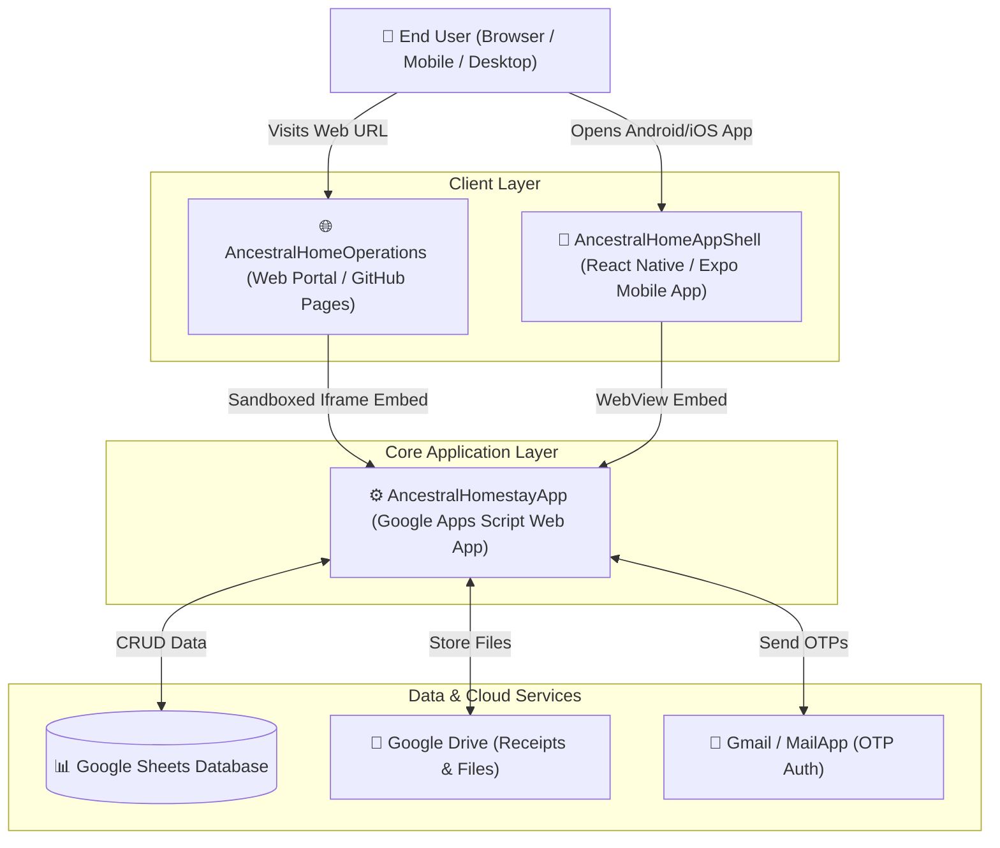
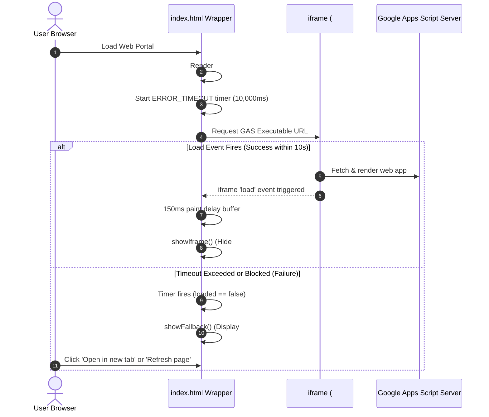

# 🌐 Ancestral Home Operations - Web Portal: Knowledge Base

**Document Version:** 1.0.0  
**Last Updated:** September 2026  
**Primary Repository:** `theancestralhomestay/AncestralHomeOperations`  
**Deployment Target:** Static Web Hosting / GitHub Pages  
**Target Application:** Google Apps Script Web App (`AKfycbzsSJKyUnW6FDAvHbiDbqRitg2SOPECjgBkk1_vGIZbYsgmf2LuFVQqV4dbyoV-3tg6mQ`)

---

## 1. System Overview & Ecosystem Architecture

The **Ancestral Home Operations Web Portal** serves as the lightweight, high-reliability web entryway and responsive wrapper for **The Ancestral Home Operations & Settlement Manager**. It embeds the Google Apps Script (GAS) Web Application inside a secure, full-viewport iframe while providing critical user-experience enhancements: seamless loading transitions, device-aware layout handling, accessibility adaptations, and graceful error recovery.

### The Ancestral Homestay Platform Ecosystem



---

## 2. Technical Stack & Architecture

- **Format:** Single Page Static Web Wrapper (`index.html`)
- **Languages:** HTML5, CSS3, Vanilla JavaScript (ES5/ES6 compatible)
- **Design Paradigm:** Zero-dependency, lightweight, mobile-first responsive architecture
- **Embedded Endpoint:** Google Apps Script Executable URL (`/macros/s/.../exec`)
- **Hosting Compatibility:** GitHub Pages, Netlify, Vercel, Cloudflare Pages, or static S3 bucket

---

## 3. Core Component & Behavioral Specifications

### A. Dynamic Viewport & Mobile Address Bar Handling
On mobile browsers (iOS Safari, Android Chrome), browser navigation toolbars dynamically shrink/expand during scrolling, causing CSS `100vh` to produce undesirable layout overflow or clipping.
- **Implementation:**
  ```javascript
  function setSize() {
    iframe.style.height = window.innerHeight + 'px';
  }
  window.addEventListener('resize', setSize);
  setSize();
  ```
- **Benefit:** Maintains exact full-height alignment with dynamic mobile browser viewports.

---

### B. Security & Iframe Sandboxing
The embedded iframe uses explicit HTML5 `sandbox` attributes to balance functionality with browser security constraints:

| Sandbox Attribute | Purpose |
| :--- | :--- |
| `allow-scripts` | Enables the Google Apps Script web application's JavaScript engine to execute. |
| `allow-forms` | Permits form submissions (e.g., OTP authentication, expense logging, income entry). |
| `allow-same-origin` | Allows the embedded document to retain its origin context for local storage/session storage and cookies. |
| `allow-popups` | Permits opening external links (e.g., viewing receipts in Google Drive, opening Google auth prompts). |
| `allowfullscreen` | Enables media/receipt previews to utilize full-screen mode when supported. |

---

### C. State Lifecycle & Timing Engine



1. **Initial State:** `#loader` is displayed with a CSS spinning loader. `#frame` is hidden via `visibility: hidden`.
2. **Success State (`load` event):** Once the iframe fires its `load` event, a `150ms` delay buffer executes before setting `#frame` to `visibility: visible` and hiding `#loader`. This prevents visual flicker during sub-resource painting.
3. **Failure State (10s Timeout):** If cross-origin blocking, network failure, or timeout occurs, `#fallback` is displayed with:
   - **Direct Link Button:** Opens the GAS URL directly in a new browser tab (`target="_blank"`).
   - **Refresh Page Button:** Triggers `window.location.reload()` for clean retry.
   - **Support Contact Link:** Directs users to `the.ancestral.home.stay@gmail.com`.

---

### D. Accessibility & Motion Preferences
Respects user OS/browser preferences for reduced motion:
```javascript
try {
  var prefersReduced = window.matchMedia('(prefers-reduced-motion: reduce)');
  if (prefersReduced && prefersReduced.matches) {
    var s = document.querySelector('.spinner');
    if (s) s.style.animation = 'none';
  }
} catch (e) {}
```

---

## 4. File Structure & Configuration

```
ancestralhomeoperations/
├── .git/                   # Git version control metadata
├── index.html              # Core single-file portal application
└── KNOWLEDGE_BASE.md       # Architectural specification and operations manual
```

### Key Configuration Variables (`index.html`)

| Parameter | Current Value | Description |
| :--- | :--- | :--- |
| **Iframe Source (`src`)** | `https://script.google.com/macros/s/AKfycbzsSJKyUnW6FDAvHbiDbqRitg2SOPECjgBkk1_vGIZbYsgmf2LuFVQqV4dbyoV-3tg6mQ/exec` | Production GAS Web App deployment endpoint |
| **Fallback Link (`href`)**| `https://script.google.com/macros/s/AKfycbzsSJKyUnW6FDAvHbiDbqRitg2SOPECjgBkk1_vGIZbYsgmf2LuFVQqV4dbyoV-3tg6mQ/exec` | Direct fallback link for blocked embeds |
| **Timeout (`ERROR_TIMEOUT`)** | `10000` (10 seconds) | Milliseconds before fallback error view is presented |
| **Contact Support** | `the.ancestral.home.stay@gmail.com` | Primary support and inquiry email |

---

## 5. Deployment & Maintenance Procedures

### Deploying Updates via Git
1. Ensure changes in `index.html` are tested across desktop and mobile browsers.
2. Commit and push to `main`:
   ```bash
   git add index.html KNOWLEDGE_BASE.md
   git commit -m "Update operations portal configuration"
   git push origin main
   ```
3. If GitHub Pages is configured on the `main` branch, changes will be published automatically.

### Updating the Target Google Apps Script URL
When a new major version or new deployment ID is created in `ancestralhomestayapp`:
1. Open [`index.html`](file:///sdcard/Projects/ancestralhomestay/ancestralhomeoperations/index.html).
2. Update the `src` in line 31:
   ```html
   <iframe id="frame" src="<NEW_DEPLOYMENT_URL>" ...></iframe>
   ```
3. Update the fallback link `href` in line 47:
   ```html
   <a id="openLink" class="btn" href="<NEW_DEPLOYMENT_URL>" ...>Open in new tab</a>
   ```

---

## 6. Troubleshooting & Common Issues

| Issue / Symptom | Root Cause | Solution |
| :--- | :--- | :--- |
| **Fallback Screen Appears Immediately or after 10s** | 1. Third-party cookies blocked in Safari/Chrome preventing GAS authentication.<br>2. Google account not logged in or corporate workspace security policy blocks embedding. | Click **"Open in new tab"** button to open the Web App directly in the browser. |
| **Black/Blank Screen on Mobile** | Browser height calc failure or ad-blocker blocking Google Script domain. | Verify `setSize()` resize listener and ensure `script.google.com` is whitelisted. |
| **Changes in GAS Backend Not Reflecting** | Browser caching iframe content or GAS deployment not updated. | Click **"Refresh page"** or hard refresh (`Ctrl + Shift + R` / `Cmd + Shift + R`). Ensure GAS script has a new version deployment. |

---

## 7. Change & Release History

| Commit | Date | Summary of Changes |
| :--- | :--- | :--- |
| `bc8d05f` | 2026-08-18 | Cleared default text in loader div for cleaner UI |
| `8d2e892` | 2026-08-18 | Updated iframe sandbox attributes and enhanced fallback error messaging |
| `203562b` | 2026-08-18 | Implemented loading spinner animation, 10s graceful timeout, and retry button |
| `5388d27` | 2026-08-11 | Updated iframe source URL to latest Google Script web app deployment |
| `3f32cae` | 2026-08-11 | Initial creation of responsive full-page iframe wrapper |
